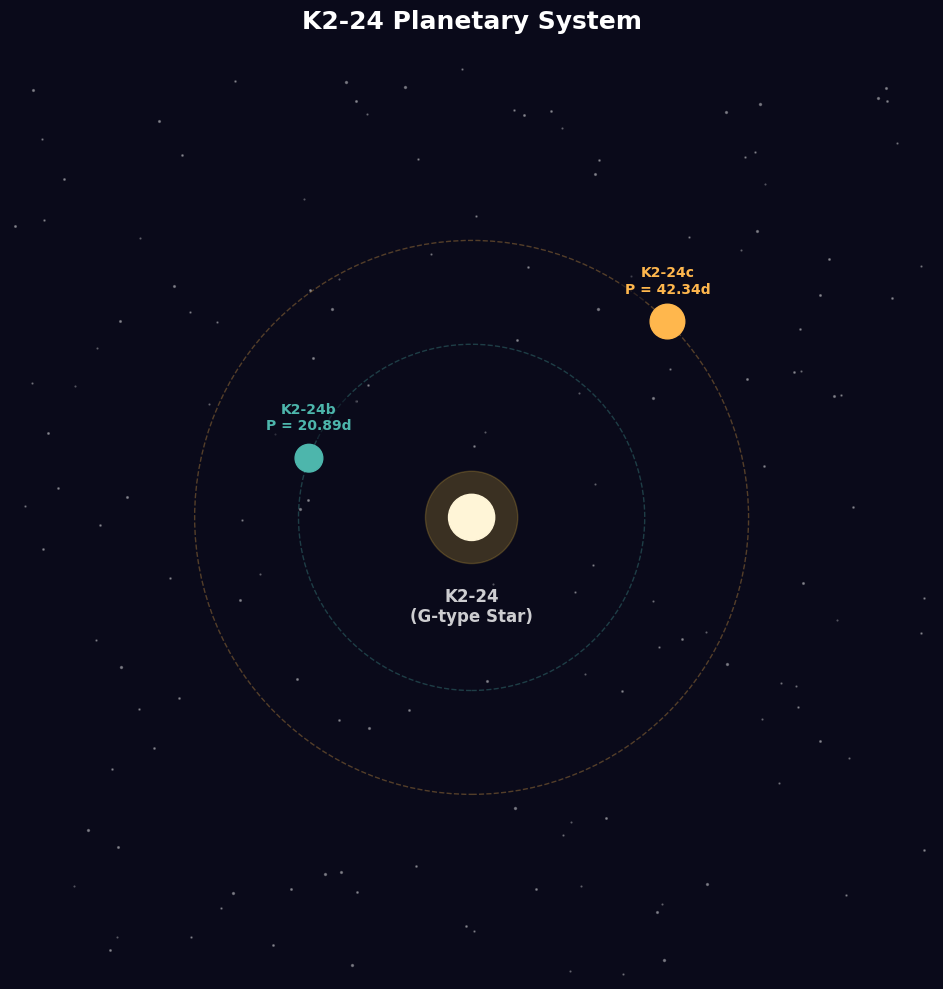
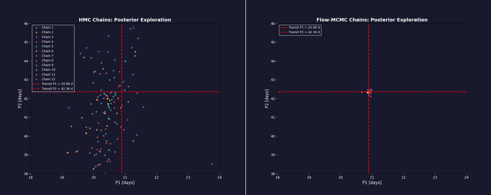
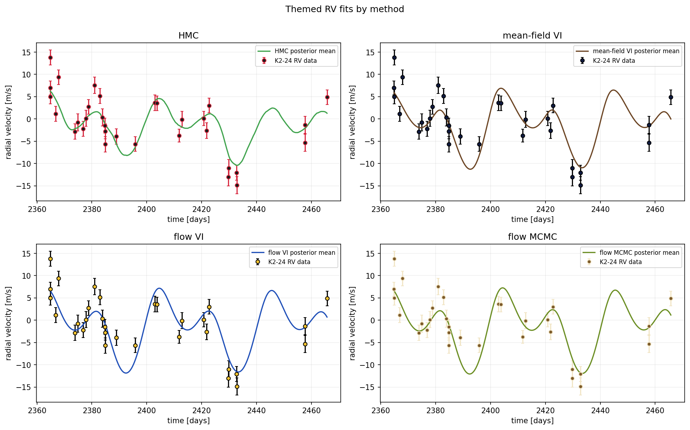
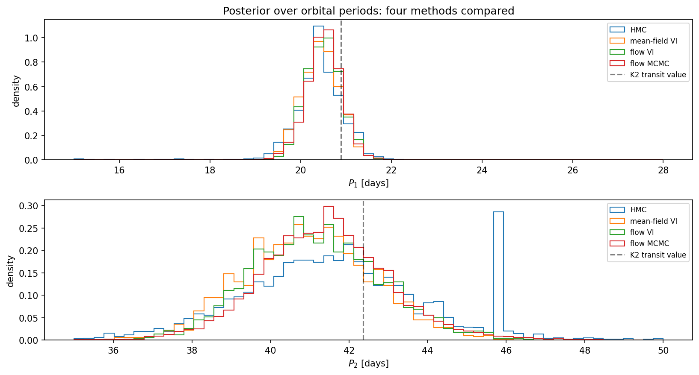

<div align="center">
  
</div>

</br>

K2-24 (EPIC 203771098) is a star about 530 light-years away hosting two confirmed planets. The California Planet Search team measured its radial velocity 32 times with Keck/HIRES, and those measurements are the data this whole project is built around. The goal is straightforward: given the wobble of the star, figure out the orbital parameters of both planets, and then compare four different ways of doing that inference.

</br>

<div align="center">
  
</div>
<p align="center"><b>Artistic Rendition of the  K2-24 System</b></p>

The four methods are Hamiltonian Monte Carlo, mean-field variational inference, normalizing flow-based variational inference (planar normalizing flows, following Rezende & Mohamed 2015), and flow-augmented markov chain monte carlo (Real-NVP coupled with MALA, following Gabrié et al. 2022). Each method targets the same 12-dimensional posterior. The comparison is about what you gain when you add a normalizing flow to each respective baseline.

---

## The Dataset

There are 32 radial velocity measurements from Petigura et al. (2016, 2018), available through the RadVel package. The K2 transit periods are 20.89 days for the inner planet and 42.36 days for the outer one, these are the ground truth the posteriors should be near, not exactly at, since RV data has less timing precision than transit photometry.

The data loads directly from the RadVel GitHub in both the notebook and `cross_method.py`. There's also a local copy in `data/`.

---

## Methods

**HMC** (`hmc.py`): leapfrog integrator with an MH correction, 12 chains running in parallel, each one starting from eta=0 (which lands exactly on the K2 transit configuration). 300 burn-in steps, then 500 samples per chain.

**Mean-field VI** (`vi_meanfield.py`) is the simplest of the four: a diagonal Gaussian variational family, ELBO maximized with Adam and a cosine LR decay. Converges fast, but a diagonal Gaussian can't represent correlations between parameters, that's a structural limit, not a tuning problem.

**Flow VI** (`vi_flow.py`) starts from the same diagonal Gaussian and pushes it through 8 planar layers to get a richer family. Takes longer to train, and the ELBO improvement is real, about 4 nats over mean-field, even though the marginal histograms end up looking almost identical. The gain shows up in the joint distribution, not the marginals (more on why that matters below).

**FlowMC** (`flowmc.py`): 24 parallel MALA chains with a Real-NVP flow training concurrently on their history. MALA handles local exploration, the flow proposes the occasional global jump once past a 50-step warmup. Global acceptance sits around 0.02, which sounds low, but it's enough to meaningfully change how robust the pooled posterior ends up being.

<div align="center">
  
  <br><em>HMC chains (left) vs FlowMC chains (right) exploring the P1–P2 posterior.</em>
</div>

---

## Results

All four methods agree on the posterior mode: P1 around 20.4–20.5 days, P2 around 41–41.5 days, both within about half a day of the transit values. The interesting differences are in how they characterize uncertainty.

Rezende & Mohamed's headline claim, that a flow gives a strictly better approximation than mean-field, holds up here: the ELBOs back it up. Here's the part that would fool you though: the marginal period histograms are nearly identical between the two methods. The flow's actual gain comes from modeling joint correlations (period-eccentricity, period-amplitude) rather than reshaping the marginals, so judging this comparison by eyeballing histograms alone would lead you to conclude the flow barely helped. It's the ELBO that tells the real story.

Neither VI method captures multimodality. HMC's P1 histogram shows secondary peaks at aliased periods around 10 and 15 days; both VI posteriors are clean unimodals at the dominant mode. Planar flows are local deformations of a single Gaussian, not architectures that can span well-separated modes. That's a known limitation, not a bug.

On the MCMC side, HMC's pooled P2 posterior comes out with a standard deviation of 88 days at first glance, which looks absurd. Looking at individual chains tells a calmer story: 11 of 12 have acceptance rates between 0.47 and 0.93 and explore the posterior normally. Chain 6 drifted into a high-curvature region where the fixed leapfrog parameters broke down (acceptance 0.286), and at least one chain wandered into the prior tail at large P2 and got stuck there. The 88-day number comes down to one or two pathological chains dragging the pooled statistic around. FlowMC gets P2's std down to 3.15 days and produces a noticeably cleaner posterior. The reason isn't that each chain mixes dramatically better on its own, it comes down to redundancy: with 24 chains plus occasional global proposals, a couple of bad chains can't drag the pooled statistic around the way chain 6 did for HMC.

</br>

<div align="center">
  
  <br><em>Posterior-mean RV fits from all four methods overlaid on the K2-24 data.</em>
</div>

</br>

<div align="center">
  
  <br><em>P1 and P2 marginal posteriors across all four methods.</em>
</div>

---

## Project Layout

```
wobbleflowfolder/
├── notebooks/wobbleflow.ipynb   # full analysis, interactive
├── cross_method.py              # script version: runs all four methods end-to-end
├── src/
│   ├── orbits/
│   │   ├── kepler.py            # Kepler equation, RV model, log-likelihood
│   │   ├── priors.py            # log-prior, log-posterior
│   │   └── transforms.py       # normalized reparameterization (eta-space)
│   ├── flows/
│   │   ├── planar.py            # PlanarLayer (used by flow VI)
│   │   └── realnvp.py           # CouplingLayer + RealNVP (used by FlowMC)
│   ├── inference/
│   │   ├── hmc.py               # HMC with leapfrog
│   │   ├── vi_meanfield.py      # mean-field VI
│   │   ├── vi_flow.py           # flow VI
│   │   └── flowmc.py            # FlowMC (MALA + flow proposals)
│   └── diagnostics/
│       ├── ess.py               # autocorrelation, ESS, posterior summary
│       └── plots.py             # shared plotting helpers
├── tests/                       # pytest suite
├── data/epic203771098.csv       # local copy of the K2-24 RV data
└── assets/                      # figures and animations
```

The notebook and the scripts are the same code. The notebook is for interactive exploration; `cross_method.py` and the `src/` library are for running it straight from an IDE or terminal.

---

## Running wobbleflow

```bash
pip install -r requirements.txt
```

**Notebook** (interactive option, it also has in depth math explanations and you can use it for exploration):
```bash
jupyter notebook notebooks/wobbleflow.ipynb
```

**All four methods at once** (saves results to `results/` and figures to `figures/`):
```bash
python cross_method.py
```

**Tests:**
```bash
pytest tests/
```

Heads up: `cross_method.py` does a full run, HMC across 12 chains, 5000 VI iterations for flow VI, 600 FlowMC outer iterations across 24 chains. It takes a while. The notebook has the same runs broken into individual cells so you can run methods one at a time if you'd prefer. 

---

## References

Petigura, E. A.; Howard, A. W.; Lopez, E. D.; et al. Two Transiting Low-Density Sub-Saturns from K2. Astrophys. J. 2016, 818 (1), 36. 
- For the K2-24 radial velocity measurements

Rezende, D. J.; Mohamed, S. Variational Inference with Normalizing Flows. Proceedings of the 32nd International Conference on Machine Learning (ICML) 2015, 37, 1530-1538. 
- For Variational inference with normalizing flows (planar layers)

Gabrié, M.; Rotskoff, G. M.; Vanden-Eijnden, E. Adaptive Monte Carlo Augmented with Normalizing Flows. Proc. Natl. Acad. Sci. U.S.A. 2022, 119 (10), e2109420119.
- (For adaptive MCMC with normalizing flows (FlowMC))

Kipping, D. M. Parametrizing the Exoplanet Eccentricity Distribution with the Beta Distribution. Mon. Not. R. Astron. Soc.: Lett. 2013, 434 (1), L51-L55. 
- For the empirical eccentricity prior (Beta distribution)
